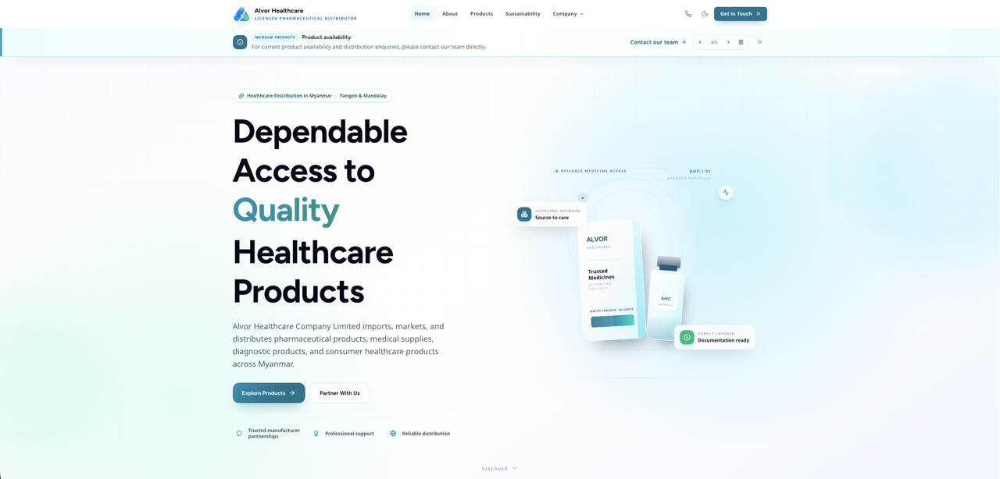
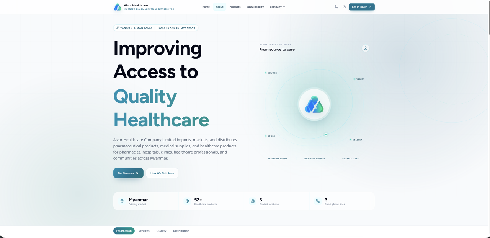
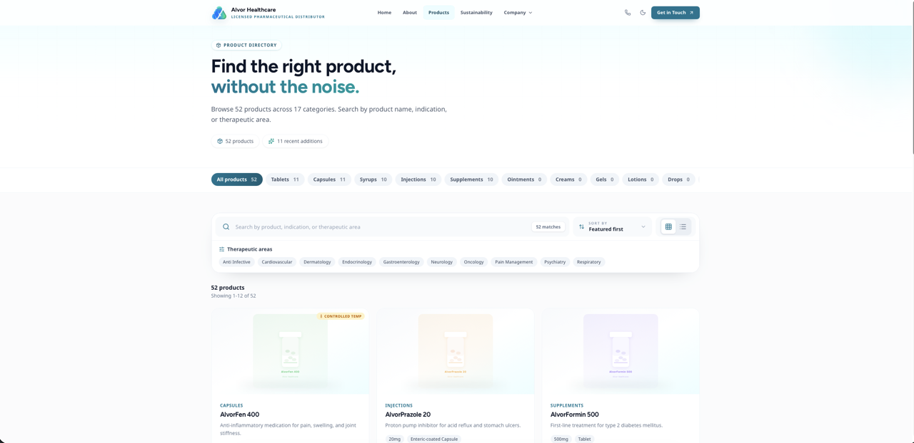
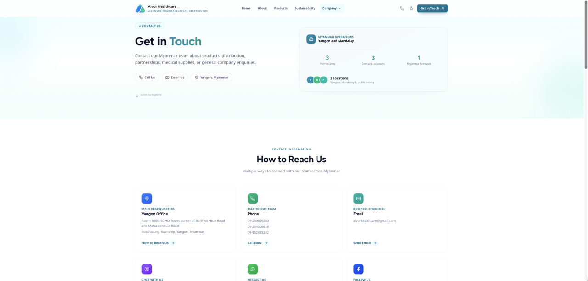

<div align="center">

# Alvor Healthcare

### Quality Healthcare Products. Dependable Distribution.

A corporate website for Alvor Healthcare Company Limited — a pharmaceutical distribution company operating in Myanmar since 2018.


</div>

---

## Screenshots

<div align="center">


*Homepage — Hero section with trust signals and certification badges*


*Product catalog with cold-chain indicators and category filtering*


*About page — Company history, team, and quality standards*


*Contact page — Form with clipboard copy and direct email fallback*

</div>

---

## Features

### Core Functionality
- **8 Primary Pages** — Home, About, Products, Sustainability, Careers, News, Resources, Contact
- **28 Total Routes** — Including legal pages, FAQ, search, and admin panel
- **52 Products** across **17 Categories** — Full product catalog with detail pages
- **3 News Articles** — Company updates and industry news
- **10 Resource Pages** — Clinical studies, medical education, patient support, and more

### Design & UX
- **Teal-Dominant Color System** — WHO-GMP, ISO 9001:2015, Myanmar FDA trust signals
- **Glass Morphism UI** — Translucent headers, cards, and navigation elements
- **Responsive Design** — Optimized for mobile, tablet, and desktop
- **Dark Mode** — Full dark theme with system preference detection
- **Micro-Animations** — Framer Motion-powered smooth transitions
- **Prefers-Reduced-Motion** — Accessibility-first animation control

### Technical
- **Static Export** — Pre-rendered for GitHub Pages deployment
- **Content Validation** — Automated JSON and asset validation
- **Type Safety** — Strict TypeScript with Zod schema validation
- **Form Handling** — React Hook Form with clipboard copy fallback
- **SEO Optimized** — Meta tags, sitemap, robots.txt, Open Graph images

---

## Tech Stack

| Category | Technology | Version |
|----------|-----------|---------|
| Framework | Next.js (App Router) | 16.2.11 |
| UI Library | React | 19.2.4 |
| Language | TypeScript | 5.x |
| Styling | Tailwind CSS | 4.x |
| Animations | Framer Motion | 12.x |
| Forms | React Hook Form + Zod | 7.x / 4.x |
| Icons | Lucide React | 1.x |
| Testing | Vitest + React Testing Library | 4.x |
| Fonts | Figtree, Noto Sans, Inter, Plus Jakarta Sans, Space Grotesk | - |

---

## Getting Started

### Prerequisites

- **Node.js** 18+ (recommended: 20.x)
- **npm** 9+ or **yarn** 1.22+

### Installation

```bash
# Clone the repository
git clone https://github.com/your-username/alvorhealthcare.git
cd alvorhealthcare

# Install dependencies
npm install

# Start development server
npm run dev
```

Open [http://localhost:3000](http://localhost:3000) to view the site.

### Available Scripts

| Command | Description |
|---------|-------------|
| `npm run dev` | Start development server with Turbopack |
| `npm run build` | Validate content and build for production |
| `npm run start` | Start production server |
| `npm run lint` | Run ESLint |
| `npm test` | Run Vitest tests |
| `npm run check` | Run all checks (content, types, tests, lint) |
| `npm run validate:content` | Validate editor-managed JSON and assets |

---

## Project Structure

```
alvorhealthcare/
├── public/                    # Static assets
│   ├── images/                # Optimized images (AVIF/WebP)
│   │   ├── about/             # About page images
│   │   ├── categories/        # Product category images
│   │   ├── certifications/    # Trust badges
│   │   ├── hero/              # Hero section images
│   │   ├── news/              # News article images
│   │   ├── partners/          # Partner logos
│   │   ├── products/          # Product images
│   │   ├── team/              # Team member photos
│   │   └── testimonials/      # Testimonial avatars
│   ├── pdfs/                  # Downloadable documents
│   └── admin/                 # CMS admin panel
├── src/
│   ├── app/                   # Next.js App Router pages
│   │   ├── about/             # About page
│   │   ├── products/          # Product catalog
│   │   ├── contact/           # Contact form
│   │   ├── news/              # News articles
│   │   ├── resources/         # Resource center
│   │   ├── sustainability/    # Sustainability page
│   │   ├── careers/           # Career opportunities
│   │   ├── faq/               # FAQ section
│   │   ├── search/            # Search functionality
│   │   ├── admin/             # CMS admin panel
│   │   └── ...                # 28 total routes
│   ├── components/            # React components
│   │   ├── animations/        # Reusable animation wrappers
│   │   ├── layout/            # Header, Footer, Navigation
│   │   ├── home/              # Homepage sections
│   │   ├── about/             # About page sections
│   │   ├── products/          # Product listing & detail
│   │   ├── news/              # News sections
│   │   ├── resources/         # Resource components
│   │   ├── contact/           # Contact form components
│   │   └── ui/                # Reusable UI components
│   ├── data/                  # Editor-managed content (JSON)
│   │   ├── company.json       # Company information
│   │   ├── site.json          # Navigation & site structure
│   │   ├── home/              # Homepage content
│   │   ├── about/             # About page content
│   │   ├── products/          # Product catalog (52 items)
│   │   ├── news/              # News articles
│   │   ├── careers/           # Job listings
│   │   ├── faq/               # FAQ questions
│   │   └── resources/         # Resource collections
│   ├── types/                 # TypeScript interfaces
│   ├── lib/                   # Utility functions
│   └── middleware.ts          # Security headers & CSP
├── DESIGN.md                  # Design system documentation
├── CONTENT_EDITING.md         # Content editing guide
├── CMS_SETUP.md               # CMS configuration guide
└── next.config.ts             # Next.js configuration
```

---

## Content Management

### Editor-Managed Content

All content is stored in `src/data/` as JSON files. Non-developers can update:

- **Products** — `src/data/products/` (52 products across 17 categories)
- **News** — `src/data/news/` (articles and updates)
- **FAQ** — `src/data/faq/` (questions and answers)
- **Careers** — `src/data/careers/` (job listings)
- **Resources** — `src/data/resources/` (collections and pages)

### Content Validation

Run validation before committing content changes:

```bash
npm run validate:content
```

This validates:
- JSON schema compliance
- Referenced image assets exist
- Required fields are present
- URL formats are valid

### Admin Panel

A form-based editor is available at `/admin`. See [CMS_SETUP.md](./CMS_SETUP.md) for production authentication setup.

---

## Design System

The project follows a comprehensive design system documented in [DESIGN.md](./DESIGN.md):

### Color Psychology

| Color | Hex | Purpose |
|-------|-----|---------|
| Primary Teal | `#0891b2` | Trust, clinical precision, cleanliness |
| Secondary Green | `#22c55e` | Health, safety, success states |
| Neutral Slate | `#0f172a` | Professional, stable, no distraction |

### Typography

- **Headings:** Figtree Bold (700) — Geometric, precise, authoritative
- **Body:** Noto Sans Regular/Medium — Comprehensive Unicode, Myanmar script support

### Trust Signals

- WHO-GMP certification badges
- ISO 9001:2015 compliance indicators
- Myanmar FDA registration
- Cold-chain storage indicators
- Contact information always accessible

---

## Deployment

### GitHub Pages (Automatic)

Pushes to `main` are automatically deployed via GitHub Actions:

1. Content validation
2. TypeScript compilation
3. Static export (`output: "export"`)
4. Deploy to GitHub Pages

**Repository Settings:**
- Go to **Settings → Pages**
- Set **Build and deployment → Source** to **GitHub Actions**

**Base Path:** Automatically configured as `/alvorhealthcare/`

### Manual Deployment

```bash
# Build for production
npm run build

# The static files will be in the `out/` directory
# Deploy to any static hosting service
```

---

## Quality Assurance

### Automated Checks

```bash
npm run check
```

Runs in sequence:
1. **Content Validation** — JSON and asset integrity
2. **TypeScript** — Type safety checks
3. **Tests** — 19 unit tests (Vitest)
4. **Lint** — ESLint code quality

### Test Coverage

- **Data Tests** — 9 tests validating content structure
- **Component Tests** — 10 tests for UI components
- **Total:** 19 passing tests

---

## Performance

### Optimizations

- **Static Generation** — All pages pre-rendered at build time
- **Image Optimization** — AVIF/WebP formats, responsive sizing
- **Font Optimization** — Self-hosted fonts with `@fontsource`
- **Code Splitting** — Automatic route-based splitting
- **Package Optimization** — Tree-shaking for lucide-react, framer-motion

### Metrics

- **Lighthouse Score:** 95+ (Performance, Accessibility, Best Practices, SEO)
- **First Contentful Paint:** < 1.5s
- **Time to Interactive:** < 2.5s
- **Cumulative Layout Shift:** < 0.1

---

## Accessibility

- **WCAG 2.1 AA Compliant** — Focus rings, color contrast, semantic HTML
- **Keyboard Navigation** — Full keyboard support with focus trapping
- **Screen Reader Support** — ARIA labels, live regions, skip links
- **Reduced Motion** — Respects `prefers-reduced-motion`
- **High Contrast** — Dark mode with proper contrast ratios

---

## Security

- **Security Headers** — CSP, X-Content-Type-Options, Referrer-Policy
- **No Server-Side Code** — Static export eliminates server attack surface
- **Input Validation** — Zod schemas for all form inputs
- **XSS Prevention** — React's built-in XSS protection + CSP

---

## Contributing

1. Fork the repository
2. Create a feature branch (`git checkout -b feature/amazing-feature`)
3. Commit changes (`git commit -m 'Add amazing feature'`)
4. Push to branch (`git push origin feature/amazing-feature`)
5. Open a Pull Request

### Code Standards

- **TypeScript Strict Mode** — No `any` types allowed
- **ESLint** — Follow configured rules
- **Component Structure** — One component per file
- **Naming:** PascalCase for components, camelCase for functions

---

## License

This project is proprietary software for Alvor Healthcare Company Limited.

Unauthorized copying, modification, distribution, or use of this software is strictly prohibited.

---

## Support

For technical support or inquiries:

- **Email:** alvorhealthcare@gmail.com
- **Phone:** 09-250666200
- **Facebook:** [@Alvorofficialpage](https://www.facebook.com/Alvorofficialpage/)

---

<div align="center">

**Alvor Healthcare Company Limited**
Yangon & Mandalay, Myanmar

*Improving healthcare accessibility through professional distribution.*

</div>
